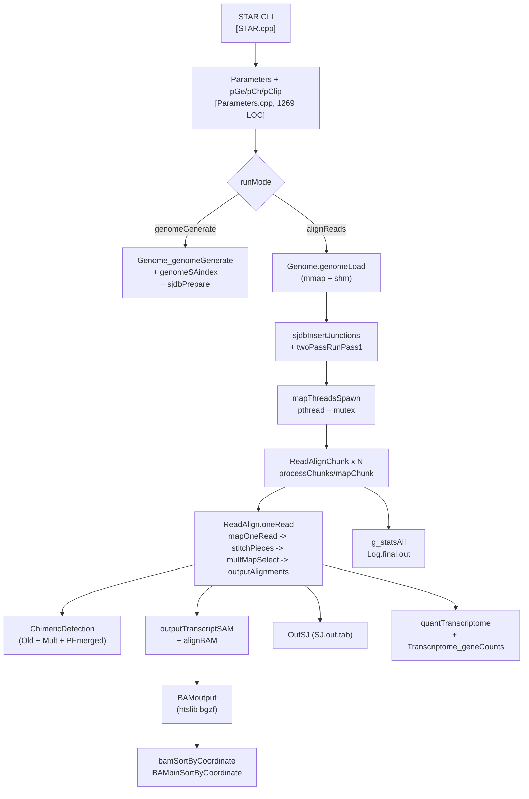

# STAR 1:1 Rust Port 计划

## 0. 目标与验证基线
- 原二进制：[STAR/bin/Linux_x86_64/STAR](STAR/bin/Linux_x86_64/STAR)（v2.7.11b）。
- 目标：`star-rs` CLI 在相同 CLI 参数下，对 **同一 `genomeDir` + 同一输入 FASTQ** 产出**字节级等价**的 `Aligned.out.sam`、`SJ.out.tab`、`Chimeric.out.junction`、`ReadsPerGene.out.tab`、`Log.final.out`（允许时间戳/路径差异）。
- 二进制等价 index：`genomeGenerate` 产出的 `Genome`、`SA`、`SAindex`、`sjdbList.out.tab` 与原版 bit-exact 对比（通过 `cmp`）。
- 回归测试来源：`ENCSR000AJI` 子集 / `extras/` 目录里已有的小测试数据 + 上游 issue 经典用例。

## 1. 架构总览（需要覆盖的部分）



## 2. 三方依赖策略

STAR 依赖 3 个非 Rust 组件 + OS 原语，需分别选型：

- **htslib（BAM/BGZF/SAM header；~40 调用点）**
   `noodles`（纯 Rust BAM/BGZF/SAM）— 无 C 依赖，但 BGZF 字节布局需自行验证与原 htslib `bgzf_write` 一致（block 大小、压缩级别、EOF marker 基本相同）。

- **opal（AVX2 SIMD Smith-Waterman，仅被 `SpliceGraph_swScoreSpliced.cpp` / `ClipCR4.cpp` 使用）**
  - 首期你选的范围（core+chimeric+2-pass）里，SpliceGraph 不启用，**opal 只被 `ClipCR4`（`--clip5pAdapterSeq` 路径）触发**。
  - **推荐：首期 FFI 保留 `opal.o`**，只暴露 1 个入口；后续可考虑 `block-aligner` crate 替换。
- **SimpleGoodTuring**：仅被 STARsolo 使用，首期**不触碰**。
- **pthread + mutex + OpenMP**：Rust 侧用 `std::thread` + `parking_lot::Mutex`（或 `std::sync::Mutex`）；OpenMP 在 STAR 里只用于 SA 排序的 `#pragma omp parallel for`，用 `rayon` 替代。
- **POSIX shmget/shmat（`SharedMemory.cpp`，291 LOC）**：首期**仅实现 `--genomeLoad NoSharedMemory` 模式**（用 `memmap2` 做只读 mmap），跳过 Load/Keep/Remove/LoadAndExit 这些共享内存模式（占用户极少数场景）。此简化**不破坏 1:1 输出等价**，只是拒绝 `genomeLoad != NoSharedMemory`。

## 3. Rust workspace 结构

```text
star-rs/
├── Cargo.toml                    # workspace
├── crates/
│   ├── star-core/                # IncludeDefine 常量、类型别名、PackedArray、SequenceFuns、serviceFuns
│   ├── star-params/              # Parameters, ParametersGenome, ParametersChimeric, ParametersClip, parametersDefault 嵌入
│   ├── star-genome/              # Genome, SA/SAi 构建、sjdb 构建、FASTA 扫描、genomeGenerate
│   ├── star-io/                  # InOutStreams、readLoad、fastq/fasta 解码、readFilesCommand 子进程
│   ├── star-align/               # ReadAlign, stitchPieces, extendAlign, stitchAlignToTranscript, Transcript
│   ├── star-chimeric/            # ChimericDetection, ChimericAlign, ChimericSegment
│   ├── star-quant/               # Transcriptome, Quantifications, 基因计数
│   ├── star-bam/                 # BAMoutput、bamSortByCoordinate、alignBAM；FFI 到 hts-sys
│   ├── star-sjdb/                # sjdbInsertJunctions, twoPassRunPass1, OutSJ
│   ├── star-stats/               # Stats, g_statsAll, Log.final.out
│   ├── opal-sys/                 # FFI 封装到 opal.o（或条件编译）
│   └── star-cli/                 # main, usage, runMode 分派
└── tests/                        # 与 C++ 原版对拍
```

## 4. 模块映射表（C++ -> Rust crate；按依赖拓扑排序）

### 第 0 层 · 基础（无依赖）

- [IncludeDefine.h](STAR/source/IncludeDefine.h) -> `star-core::types`（定义 `Uint = u64`, `IntScore = i32`, `uiPC/uiWC/uiWA` 作 `struct`；保留 `MAX_N_EXONS`, `MAX_N_MULTMAP`, `BAM_CIGAR_*`, `ATTR_*`, `MARKER_*`）。注意 `uint = unsigned long long` 是 **64 位**，全程用 `u64`，不要图省事用 `usize`。
- [PackedArray.h/.cpp](STAR/source/PackedArray.cpp) -> `star-core::packed`。索引器
```24:32:STAR/source/PackedArray.h
inline uint PackedArray::operator [] (uint ii) {
   uint b=ii*wordLength;
   uint B=b/8;
   uint S=b%8;
   uint a1 = *((uint*) (charArray+B));
   a1 = ((a1>>S)<<wordCompLength)>>wordCompLength;
```
用 `u64::from_le_bytes` + 位移，需要保留对 `SA`/`SAi` 的 8-byte unaligned load 语义，用 `read_unaligned`。
- [SequenceFuns.cpp](STAR/source/SequenceFuns.cpp)（445 LOC）-> `star-core::seq`：ACGTN↔0..4 映射、reverse-complement、qual 处理。
- [serviceFuns.cpp](STAR/source/serviceFuns.cpp)（351 LOC，头文件即实现的模板）-> `star-core::service`：binarySearch、funCompareUintAndSuffixes 等。
- [ErrorWarning.cpp](STAR/source/ErrorWarning.cpp)、[TimeFunctions.cpp](STAR/source/TimeFunctions.cpp)、[streamFuns.cpp](STAR/source/streamFuns.cpp) -> `star-core::{error,time,stream}`，用 `anyhow`/`thiserror`。
- [stringSubstituteAll.cpp](STAR/source/stringSubstituteAll.cpp)、[systemFunctions.cpp](STAR/source/systemFunctions.cpp) -> `star-core::util`。

### 第 1 层 · Parameters（读全部参数；影响一切）

- [Parameters.cpp](STAR/source/Parameters.cpp)（1269 LOC）+ 5 个 `Parameters_*.cpp` + [ParameterInfo.h](STAR/source/ParameterInfo.h) -> `star-params`。
- [parametersDefault](STAR/source/parametersDefault)（919 行）：**用 `include_bytes!` 嵌入**，和原版 `parametersDefault.xxd` 等价。
- [ParametersGenome](STAR/source/ParametersGenome.cpp)、[ParametersChimeric_initialize.cpp](STAR/source/ParametersChimeric_initialize.cpp)、[ParametersClip_initialize.cpp](STAR/source/ParametersClip_initialize.cpp) 分别对应子 crate 模块。
- **关键 1:1 点**：参数解析顺序（default -> 文件 -> 命令行）、log.out 中写回的 `used parameters` 文本格式必须完全一致，否则对拍 diff 爆。
- Solo/WASP/var/GTF 相关字段首期**保留类型但不实现业务**。

### 第 2 层 · Genome（索引读写）

- [Genome.cpp](STAR/source/Genome.cpp)、[Genome_genomeLoad.cpp](STAR/source/Genome_genomeLoad.cpp)（520 LOC）、[Genome_genomeGenerate.cpp](STAR/source/Genome_genomeGenerate.cpp)（438 LOC）。
- [genomeSAindex.cpp](STAR/source/genomeSAindex.cpp)：SA index (L-mer lookup 表) 构建。
- [genomeScanFastaFiles.cpp](STAR/source/genomeScanFastaFiles.cpp)：FASTA 扫描。
- [genomeParametersWrite.cpp](STAR/source/genomeParametersWrite.cpp)：写 `genomeParameters.txt`。
- [SuffixArrayFuns.cpp](STAR/source/SuffixArrayFuns.cpp)（410 LOC）：SA 搜索核心。
- [funCompareUintAndSuffixes*.cpp](STAR/source/funCompareUintAndSuffixes.cpp)：SA 排序比较函数（含 8-byte vectorized compare + `has5` 空格符处理，见上面 `funCompareSuffixes`）。
- [sjdbPrepare.cpp](STAR/source/sjdbPrepare.cpp)、[sjdbBuildIndex.cpp](STAR/source/sjdbBuildIndex.cpp)、[sjdbLoadFromFiles.cpp](STAR/source/sjdbLoadFromFiles.cpp)、[insertSeqSA.cpp](STAR/source/insertSeqSA.cpp)：sjdb/insertSeq SA 插入。
- **关键 1:1 点**：SA 排序结果 bit-exact。原版用 `qsort` + 自定义比较器 + OpenMP 桶排（`sortSuffixesBucket.h`）。用 `rayon::par_sort_by` 在相同桶划分下可达 bit-exact，前提是 tie-break 完全一致（原代码里 anti-stable，需要严格复刻）。
- **共享内存首期裁剪为仅 `NoSharedMemory`**；`Genome_genomeOutLoad.cpp / Genome_insertSequences.cpp / Genome_transformGenome.cpp`（transform/genomeOut 相关）首期**禁用并报错**（超出选定范围）。

### 第 3 层 · IO 和线程模型

- [InOutStreams.cpp](STAR/source/InOutStreams.cpp)、[readLoad.cpp](STAR/source/readLoad.cpp)、[Parameters_openReadsFiles.cpp](STAR/source/Parameters_openReadsFiles.cpp)、[Parameters_closeReadsFiles.cpp](STAR/source/Parameters_closeReadsFiles.cpp)、[Parameters_readFilesInit.cpp](STAR/source/Parameters_readFilesInit.cpp) -> `star-io`。
  - 支持 `readFilesCommand`（例如 `zcat`）：用 `std::process::Command` + piped stdin 复刻原 `popen` 逻辑（STAR 用 fork+exec，PID 保留在 `P.readFilesCommandPID`）。
- [ThreadControl.cpp](STAR/source/ThreadControl.cpp) + [GlobalVariables.cpp](STAR/source/GlobalVariables.cpp)：8 个 pthread_mutex 全局。
  - Rust 侧改为一个 `struct ThreadChunks { in_read: Mutex<InReadState>, out_sam: Mutex<()>, out_bam1: Mutex<BamWriter>, ... }`，用 `Arc<ThreadChunks>` 传递，逻辑 1:1。
- [mapThreadsSpawn.cpp](STAR/source/mapThreadsSpawn.cpp) + [ReadAlignChunk.cpp](STAR/source/ReadAlignChunk.cpp) + [ReadAlignChunk_processChunks.cpp](STAR/source/ReadAlignChunk_processChunks.cpp)（302 LOC）+ [ReadAlignChunk_mapChunk.cpp](STAR/source/ReadAlignChunk_mapChunk.cpp) -> `star-align::chunk`。线程池数 = `P.runThreadN`。

### 第 4 层 · Read alignment 核心（~3500 LOC）

拓扑顺序（自底向上）：

- [Transcript.cpp](STAR/source/Transcript.cpp) + `Transcript_alignScore.cpp / _generateCigarP.cpp / _transformGenome.cpp / _variationAdjust.cpp / _variationOutput.cpp / _convertGenomeCigar.cpp` -> `star-align::transcript`。注意 `exons[MAX_N_EXONS][EX_SIZE]` 是 **栈上固定二维数组**；Rust 用 `[[u64; EX_SIZE]; MAX_N_EXONS]`（`MAX_N_EXONS=20`，或 long-reads 模式 1000，通过 feature flag 控制）。
- [extendAlign.cpp](STAR/source/extendAlign.cpp)：贪婪扩展。
- [binarySearch2.cpp](STAR/source/binarySearch2.cpp)、[blocksOverlap.cpp](STAR/source/blocksOverlap.cpp)。
- [stitchAlignToTranscript.cpp](STAR/source/stitchAlignToTranscript.cpp)（415 LOC）+ [stitchWindowAligns.cpp](STAR/source/stitchWindowAligns.cpp)（355 LOC）+ [stitchGapIndel.cpp](STAR/source/stitchGapIndel.cpp)。
- [ReadAlign.cpp](STAR/source/ReadAlign.cpp) 及其 **30 多个 `ReadAlign_*.cpp`**，重点：
  - [ReadAlign_mapOneRead.cpp](STAR/source/ReadAlign_mapOneRead.cpp)
  - [ReadAlign_maxMappableLength2strands.cpp](STAR/source/ReadAlign_maxMappableLength2strands.cpp)
  - [ReadAlign_storeAligns.cpp](STAR/source/ReadAlign_storeAligns.cpp)
  - [ReadAlign_stitchPieces.cpp](STAR/source/ReadAlign_stitchPieces.cpp)（350 LOC）
  - [ReadAlign_stitchWindowSeeds.cpp](STAR/source/ReadAlign_stitchWindowSeeds.cpp)（278 LOC）
  - [ReadAlign_multMapSelect.cpp](STAR/source/ReadAlign_multMapSelect.cpp) — 用 `std::mt19937` 做 tie-break；**必须复刻同一 PRNG 状态**才能 1:1（Rust 侧用 `rand_mt` crate 或自写 `mt19937`，种子 = `runRNGseed`）。
  - [ReadAlign_mappedFilter.cpp](STAR/source/ReadAlign_mappedFilter.cpp)
  - [ReadAlign_outputAlignments.cpp](STAR/source/ReadAlign_outputAlignments.cpp)（324 LOC）
  - [ReadAlign_outputTranscriptSAM.cpp](STAR/source/ReadAlign_outputTranscriptSAM.cpp)（359 LOC）+ `_outputTranscriptSJ.cpp` + `_outputTranscriptCIGARp.cpp` + `_calcCIGAR.cpp` + `_CIGAR.cpp`。
  - [ReadAlign_oneRead.cpp](STAR/source/ReadAlign_oneRead.cpp)：整个 read 处理主循环。
  - [ReadAlign_peOverlapMergeMap.cpp](STAR/source/ReadAlign_peOverlapMergeMap.cpp)（368 LOC）。
  - [ReadAlign_createExtendWindowsWithAlign.cpp](STAR/source/ReadAlign_createExtendWindowsWithAlign.cpp) + `_assignAlignToWindow.cpp`。
  - `waspMap / transformGenome / mapOneReadSpliceGraph / outputSpliceGraphSAM`：**首期不启用**（对应 Variation/SuperTranscript 路径）。
- [ClipMate_*.cpp](STAR/source/ClipMate_clip.cpp) + [ClipCR4.cpp](STAR/source/ClipCR4.cpp)：adapter clipping。ClipCR4 用 opal SIMD — 保留 FFI。

### 第 5 层 · Chimeric 检测

- [ChimericDetection.cpp](STAR/source/ChimericDetection.cpp) + [ChimericDetection_chimericDetectionMult.cpp](STAR/source/ChimericDetection_chimericDetectionMult.cpp) + [ChimericSegment.cpp](STAR/source/ChimericSegment.cpp) + [ChimericAlign.cpp](STAR/source/ChimericAlign.cpp) + 3 个 `ChimericAlign_*.cpp`。
- [ReadAlign_chimericDetection.cpp](STAR/source/ReadAlign_chimericDetection.cpp) + `_chimericDetectionOld.cpp`（312 LOC，旧算法，仍默认启用）+ `_chimericDetectionOldOutput.cpp` + `_chimericDetectionPEmerged.cpp` -> `star-chimeric`。
- 输出格式固定：`Chimeric.out.junction` / `Chimeric.out.sam` / `_BAM`。

### 第 6 层 · 2-pass 与 sjdb on-the-fly

- [twoPassRunPass1.cpp](STAR/source/twoPassRunPass1.cpp)：用当前二进制再跑一轮 1st pass，收集 SJ，生成带新 sjdb 的新 index，再跑 2nd pass。
- [sjdbInsertJunctions.cpp](STAR/source/sjdbInsertJunctions.cpp) + [sjdbLoadFromStream.cpp](STAR/source/sjdbLoadFromStream.cpp) + [sjAlignSplit.cpp](STAR/source/sjAlignSplit.cpp) -> `star-sjdb`。
- [OutSJ.cpp](STAR/source/OutSJ.cpp) + [outputSJ.cpp](STAR/source/outputSJ.cpp)：汇总线程级 SJ、过滤、写 `SJ.out.tab`。
- **关键 1:1 点**：sjdb 插入后 SA 仍需 bit-exact（依赖第 2 层的 SA 排序一致性）。

### 第 7 层 · BAM 输出与排序

- [BAMfunctions.cpp](STAR/source/BAMfunctions.cpp) + [BAMoutput.cpp](STAR/source/BAMoutput.cpp) + [ReadAlign_alignBAM.cpp](STAR/source/ReadAlign_alignBAM.cpp)（614 LOC，最大的文件之一）-> `star-bam`。
- [BAMbinSortByCoordinate.cpp](STAR/source/BAMbinSortByCoordinate.cpp) + [BAMbinSortUnmapped.cpp](STAR/source/BAMbinSortUnmapped.cpp) + [bamSortByCoordinate.cpp](STAR/source/bamSortByCoordinate.cpp) + [bamRemoveDuplicates.cpp](STAR/source/bamRemoveDuplicates.cpp)（271 LOC）+ [bam_cat.c](STAR/source/bam_cat.c) + [signalFromBAM.cpp](STAR/source/signalFromBAM.cpp)（wiggle 输出）+ [funPrimaryAlignMark.cpp](STAR/source/funPrimaryAlignMark.cpp)。
- [samHeaders.cpp](STAR/source/samHeaders.cpp) + [Parameters_readSAMheader.cpp](STAR/source/Parameters_readSAMheader.cpp) + [Parameters_samAttributes.cpp](STAR/source/Parameters_samAttributes.cpp)（262 LOC）。
- `htslib` 通过 `hts-sys` crate 暴露 `bgzf_*`、`sam_hdr_*`、`bam1_t`、`sam_write1`。

### 第 8 层 · Transcriptome 定量（--quantMode）

- [Transcriptome.cpp](STAR/source/Transcriptome.cpp) + 6 个 `Transcriptome_*.cpp`（`quantAlign`/`geneFullAlignOverlap`/`geneCountsAddAlign`/`alignExonOverlap`/`classifyAlign`/`geneFullAlignOverlap_ExonOverIntron`）-> `star-quant`。
- [Quantifications.cpp](STAR/source/Quantifications.cpp)：跨线程累加，输出 `ReadsPerGene.out.tab`、`Quant.toTranscriptome.out.bam`。
- [ReadAlign_quantTranscriptome.cpp](STAR/source/ReadAlign_quantTranscriptome.cpp)。

### 第 9 层 · Stats 与主程序

- [Stats.cpp](STAR/source/Stats.cpp) + [g_statsAll](STAR/source/GlobalVariables.cpp) -> `star-stats`。`Log.final.out` 逐行格式要 1:1。
- [STAR.cpp](STAR/source/STAR.cpp)（313 LOC）-> `star-cli::main`，结构与上面 mermaid 一致。

### 明确**不做**（首期）

- [Solo.cpp](STAR/source/Solo.cpp) + 30 个 `Solo*.cpp` / `SoloFeature*.cpp` / `SoloRead*.cpp` / `SoloBarcode*.cpp` / `SimpleGoodTuring/`。
- [Chain.cpp](STAR/source/Chain.cpp)（liftOver）。
- [GTF.cpp](STAR/source/GTF.cpp) + `GTF_superTranscript.cpp` + [SuperTranscriptome.cpp](STAR/source/SuperTranscriptome.cpp) + [SpliceGraph.cpp](STAR/source/SpliceGraph.cpp) + 3 个 `SpliceGraph_*.cpp`（SuperTranscript）。
- [Variation.cpp](STAR/source/Variation.cpp) + `ReadAlign_waspMap.cpp` + `Transcript_variation*.cpp` + `Genome_transformGenome.cpp` + `ReadAlign_transformGenome.cpp`（VCF 变异 + WASP）。
- 首期 `--genomeLoad` 仅支持 `NoSharedMemory`；`--readFilesType SAM SE/PE` / `SAMtag` 不支持（只支持 `Fastx`）。
- `Parameters_readSAMheader.cpp` 里与 SAM 输入相关的路径不做；SAM header 写出仍做。

## 5. 阶段性里程碑

- **M1 · 脚手架（1-2 周）**：workspace + `hts-sys` 验证 + `opal-sys` FFI 验证 + `star-core` 完成（PackedArray/SequenceFuns/service/error/time）+ `parametersDefault` 嵌入 + CLI usage 1:1。验收：`STAR --help` 输出与原版 diff 为空。
- **M2 · genomeGenerate（3-4 周）**：第 0/1/2 层打通，用小基因组（如 chr22 / phix）产出与原版 bit-exact 的 `SA`、`SAindex`、`chrNameLength.txt`、`sjdbList.fromGTF.out.tab`。验收：`cmp` 过所有索引文件。
- **M3 · alignReads 基础路径（4-6 周）**：第 3/4 层 + 第 7 层 + 第 9 层（Stats），SE FASTQ，不启用 chimeric / 2-pass / sjdb 动态插入 / quantMode。验收：`Aligned.out.sam` 与原版完全一致；`Log.final.out` 内容行一致（时间戳除外）；`SJ.out.tab` 一致。
- **M4 · PE + peOverlap + 多线程**：启用 PE + `--peOverlap` + `runThreadN>1`。多线程等价性靠 chunk 分片 + 同一 chunk 顺序保证（原版在 `processChunks` 里就是按 chunk 串行写出）。
- **M5 · sjdb 动态插入 + 2-pass**：第 6 层完成。验收：`--twopassMode Basic` 产出 2nd pass SAM 一致。
- **M6 · Chimeric 检测**：第 5 层完成。验收：`Chimeric.out.junction` / `Chimeric.out.sam` 一致。
- **M7 · Transcriptome quant + BAM 排序 + wiggle**：第 7/8 层剩余。验收：`--quantMode TranscriptomeSAM GeneCounts` + `--outSAMtype BAM SortedByCoordinate` 一致。
- **M8 · 去重 + 大规模回归**：`bamRemoveDuplicates` + ENCODE 小样本端到端。

## 6. 风险 & 关键 1:1 注意事项

- **Bit-exact 障碍点**（必须优先确认）：
  - SA 排序 tie-break（C 侧 `qsort` 非稳定）—— 首期建议用**确定性单线程 sort** 验证 bit-exact，再换成并行桶排对齐原实现。
  - `std::mt19937` 序列：Rust 的 `rand::rngs::StdRng` ≠ MT19937，需要 `rand_mt::Mt19937GenRand64` 或自写。种子来源 `runRNGseed`（默认 777）。
  - 浮点：STAR 用 `double`，路径里 `scoreGenomicLengthLog2scale * log2(...)`；Rust 用 `f64` + `log2` 在 x86-64 上结果相同。
  - `qsort` 非稳定：所有 `qsort` 调用点用 stable sort 时若结果不同，需回查原排序键是否已唯一。
- **hts-sys 的 BGZF**：原版 `BAMoutput` 用 `bgzf_write` 默认级别 `-l 1`（STAR 设定），需检查压缩级别参数透传，BGZF block 输出字节级别等价需验证。
- **栈上大数组**：`Transcript::exons[20][5]` 是 800 字节/对象，多窗口多对象时原 C++ 用 `new Transcript[...]`；Rust 用 `Vec<Transcript>` + `Box` 维持堆分配语义。
- **`__uint128_t`**：原版 `SuffixArrayFuns` 用 128 位比较，Rust 用 `u128`（原生支持）。
- **`union uint/intScore = int`**：原版用 `#define intScore int`，Rust 用 `type IntScore = i32`。
- **并发正确性**：STAR 的 8 个 mutex 是**粗粒度**（逐 chunk），Rust 侧保持相同粒度即可；不用 rayon 的 work-stealing，改用固定数量的 worker + shared `ReadReader`。

## 7. 对拍测试方案

- 固定测试集：`extras/scripts/tests/` 里已有示例；另准备 phix + chr22 + GENCODE 小子集。
- CI 矩阵：
  - `genomeGenerate`：对比索引文件 sha256。
  - `alignReads SE/PE × threads=1/4 × twopassMode off/Basic × chimSegmentMin 0/20`：对比 `Aligned.out.sam` / `SJ.out.tab` / `Chimeric.*` / `Log.final.out`（过滤时间戳/路径）/ `ReadsPerGene.out.tab` 的 sha256。
- 提供 `tools/diff_star_output.sh` 脚本：把原版与 rust 版输出 diff，忽略允许差异行（时间、路径、版本字符串）。
- 性能基线：允许 Rust 版 ±10% wall-time；内存不劣化。

## 8. 开工前需要你 / 我再确认的 1 件事

- **依赖策略**你选的是"让我分别列出每个依赖的权衡，由你选"。**推荐方案**（优先级按"最短 1:1 路径"）：
  - htslib -> `hts-sys` FFI（A）
  - opal -> FFI 保留 `.o`
  - 共享内存 -> 首期仅 `NoSharedMemory`
  - 并行 -> `rayon` + `std::thread`
  - PRNG -> `rand_mt`
  - BGZF/压缩 -> 经 htslib
  
  如同意该方案，M1 立刻开工；如需把 htslib 换成 `noodles` 或要求零 C 依赖，再议（会延后 ~4 周并增加 BGZF/sort 的对拍工作量）。
